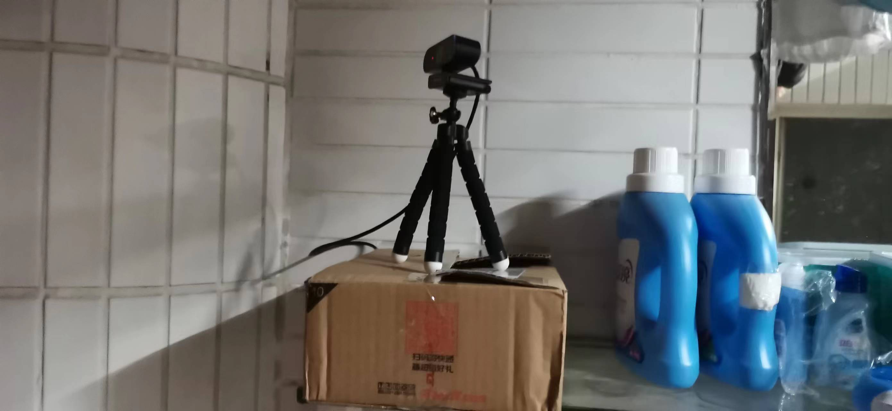

# DIY 延时摄影

## 所需材料
1. 树莓派
2. 充电宝或充电器
3. 电源线
4. USB 摄像头以及对应的支架
5. 纸盒子（用来放充电宝和树莓派）

效果：

## 短期延时摄影
1. 安装 fswebcam：`sudo apt update -y && sudo apt install fswebcam -y`
2. 把 `shot.sh` 文件拷贝到树莓派上，并给执行权限：`chmod u+x shot.sh`
3. 新建一个 cron 定时任务：`* * * * * /home/ubuntu/projects/timelapse/shot.sh >/dev/null 2>&1`。
4. 等待一段时间，图片保存在 `/home/ubuntu/Pictures/timelapse/dorm-scene/$DAY`。
5. 将图片下载到本地。
6. 处理图片并合成视频：`./conbine.sh dir`，其中 dir 替换成实际的图片文件夹。

效果：
TODO

## 长期延时摄影
TODO

## 其他
处理脚本是 ChatGPT 写的，我做了少许修改：
> 写一个 Python 脚本，该脚本的输入为一个路径，该路径下有一些图片，图片的命名格式例如：2023-02-21_22-10-01.jpg，脚本需要从图片的文件名中提取出时间，并使用 PIL 库将时间信息写入到对应图片的右下角。之后脚本需要将图片按次序重命名为 ###.jpg 的格式，排序方式为文件名降序。
> 
> 需要使用 argparse 库允许用户指定输入路径和输出路径，此外不要删除源文件。
>
> 请使用 ffmpeg 将上述处理好的图片合成为视频，解释你的参数选择，我倾向于高质量的视频

## 参考
https://www.bilibili.com/read/cv15189613